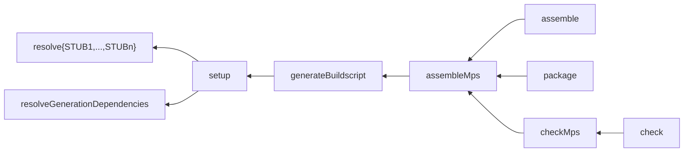

# MPS Gradle Plugin

A Gradle plugin to package and publish MPS plugins. Use it if you have developed a language in MPS and you want to make
it easy for other developers to use your language in their projects.

Publishing MPS-based IDEs (rich client platforms) is out of scope for this plugin.

This plugin also does not cover publishing to the JetBrains Plugins Repository.

## Compatibility

This plugin has been tested with the following combinations of Gradle and MPS:

* Gradle 7.1 or above is required since version 1.2.0.
* Gradle 7.2 and MPS 2020.3.5 (version 1.1.0),
* Gradle 5.6.2 and MPS 2019.2.4 (version 1.0.0),
* Gradle 5.6.2 and MPS 2019.1.5 (version 0.0.2).

## Conventions and Assumptions

To simplify the configuration the plugin makes certain assumptions and therefore your project must follow certain
conventions.

The following assumptions will hold if you let the MPS wizard generate your build solution and script:

* The MPS project directory is assumed to coincide with the Gradle project directory.
* The MPS project must contain a build model that is either named `build.mps` or matches `*.build.mps`. The build model
  must use default persistence and not file-per-root persistence.
* The build model must generate a `build.xml` file in the project's root directory.
* The variable that specifies the location of MPS in the build script is called `mps_home`.

The following conventions are different from the defaults and require manual adjustment of the generated build script:

* The default layout should also include the build solution.
* Instead of creating a .zip of all modules or plugins the default layout should just collect them in the top-level
  folder:
  ```
  default layout:
    module com.mbeddr.mpsutil.common 
    module com.mbeddr.mpsutil.common.build
  ```
  or
  ```
  default layout:
    plugin com.mbeddr.mpsutil.common [auto packaging]
      <empty>
  ```
* Any dependencies will be put under `build/dependencies` folder and can be referenced from the project's base directory
  (without using any path variables).

### Customizing Conventions

Some conventions can be customized via the `mpsDefaults` extension:

```kotlin
mpsDefaults {
    // Custom MPS home directory
    mpsHome.set(File("/my/mps/home"))
    
    // Custom location and name of the build script
    buildScript.set(file("build/build.xml"))
    
    // Custom dependencies directory
    dependenciesDirectory.set("build/project-libraries")
}
```

## Sample Project

A sample project using the plugin can be found here: https://github.com/specificlanguages/mps-gradle-plugin-sample.

## Configuration

All code snippets below use Kotlin syntax for Gradle.

1. Apply the plugin:

    ```kotlin
   // build.gradle.kts
    plugins {
        id("com.specificlanguages.mps") version "1.5.0"
    }
    ```

2. Add the itemis Nexus repository to `settings.gradle.kts`:

   ```kotlin
   // settings.gradle.kts
   pluginManagement {
       repositories {
           maven(url = "https://artifacts.itemis.cloud/repository/maven-mps")
   
           // Gradle plugin portal must be added explicitly when using non-default repositories
           gradlePluginPortal()
       }
   }
   ```

   This repository is used to
   download [mps-build-backends Gradle MPS launcher](https://github.com/mbeddr/mps-build-backends/tree/main/launcher)
   that is used to provide proper command line arguments to the backend in the next step, depending on the MPS version
   being run.

3. Add the itemis Nexus repository and the Maven Central repository to the project:

   ```kotlin
   // build.gradle.kts
   repositories {
       maven(url = "https://artifacts.itemis.cloud/repository/maven-mps")
       mavenCentral()
   }
   ```

   The itemis Nexus repository is used to download MPS as well as a small "backend" program to launch MPS from the
   command line. (The backend is part of [mps-build-backends](https://github.com/mbeddr/mps-build-backends).) Maven
   Central repository contains the Kotlin libraries that the backend depends on.

4. Use the `mps` configuration to specify the MPS version to use:

   ```kotlin
   // build.gradle.kts
   dependencies {
       "mps"("com.jetbrains:mps:2021.1.4")
   }
   ```

5. Include the dependencies necessary for generation into the `generation` configuration:

    ```kotlin
   // build.gradle.kts
    dependencies {
        "generation"("de.itemis.mps:extensions:2021.1.+")
    }
    ```

6. Specify JAR dependencies that are used as stubs and where they should be placed:

    ```kotlin
   // build.gradle.kts
    stubs {
        register("stubs") {
            destinationDir("solutions/my.stubs/lib")
            dependency("org.apache.commons:commons-lang3:3.12.0")
            ...
        }
        ...
    }
    ```

7. For publishing apply the `maven-publish` plugin and use `from(components["mps"])`:

   ```kotlin
   // build.gradle.kts
   plugins {
       ...
       `maven-publish`
   }
   ...
   publishing {
       publications {
           register<MavenPublication>("mpsPlugin") {
               from(components["mps"])
   
               // Put resolved versions of dependencies into POM files
               versionMapping { usage("java-runtime") { fromResolutionOf("generation") } }
           }
       }
   }
   ```

## Effects of Applying the Plugin

The plugin applies the [Gradle Base plugin](https://docs.gradle.org/current/userguide/base_plugin.html) which creates a
set of _lifecycle tasks_ such as `clean`, `assemble`, `check`, or `build`.

The plugin creates the following tasks:

* `setup`: unpacks all dependencies of the `generation` configuration into `build/dependencies`. Since 1.2.0 it also
  triggers the individual tasks to unpack stubs, see below. Executing the `setup` task is required before the project
  can be opened in MPS.
* ~~`resolveMpsForGeneration`: downloads the MPS artifact specified by the `mps` configuration and unpacks it into
  `build/mps`.~~ (Removed in 1.4.0.)
* `resolve<StubName>`: a [Sync](https://docs.gradle.org/current/dsl/org.gradle.api.tasks.Sync.html) task created
  for each stub block (`<StubName>` is the name of the stub entry, capitalized). The task resolves the dependencies
  configured in the stub block and copies them into the specified destination directory of the stub, deleting any other
  files present in that directory. When copying the dependencies their version numbers are stripped. This makes it
  possible to upgrade dependency versions in the Gradle build script without also reconfiguring the MPS stub solutions.
* `generateBuildscript`: generates the build script using MPS. The build model location is detected automatically. 
  Since 1.2.2 the task specifies all module files (`*.msd`, `*.mpl`, `*.devkit`) as its inputs since build scripts 
  check their contents against the modules.
* `assembleMps`: runs `generate` and `assemble` targets of the generated Ant script. The `assemble` lifecycle task is
  set to depend on `assembleMps`. Since 1.1.1 the version of the project is passed to Ant via `-Dversion=${project.
  version}`. Since 1.2.2 the task specifies all `*.mps` files in all directories as its inputs.
* `checkMps`: runs the `check` target of the generated Ant script. The `check` lifecycle task is set to depend
  on `checkMps`.
* `package`: packages the modules built by `assembleMps` in a ZIP. The package is added to the `default` configuration
  (created by the Gradle Base plugin).

The plugin creates a software component named `mps` to represent the published code and adds the `default` configuration
to it.

The plugin modifies the `clean` task to delete MPS-generated directories: `source_gen`, `source_gen.caches`,
`classes_gen`, `tests_gen`, and `tests_gen.caches`. This is in addition to the default operation of `clean` task which
deletes the project's build directory (`build`).

## Downloading and Unzipping MPS

Before version 1.4.0 the plugin declared a task, `resolveMpsForGeneration`, to download and unzip the MPS distribution
under `build/mps`. In 1.4.0 and above this is handled via Gradle artifact transforms. This should enable sharing the
MPS distributions between projects that use the same MPS version (for example, among subprojects of a large project).

The task is left empty in 1.4.0 for backwards compatibility purposes.

## Task Dependency Graph



## Configurations

The plugin creates the following configurations:

* `mps` - the distribution of MPS to use.
* `generation` - MPS libraries that the project depends on (such as mbeddr platform or MPS-extensions).
* `executeGenerators` - can be used to override the version of the `execute-generators` backend. If left unconfigured,
  a reasonable default will be used.
* `ant` - the Ant classpath. If left unconfigured, contains an `ant-junit` dependency. Can be customized if you 
  need extra libraries on the Ant classpath.

All dependencies added to `generation` configuration will have their artifact type set to `zip`. This is important for
compatibility with Maven.

Further configurations will be created by the `stubs` block.

## Stubs

MPS code can make use of Java libraries after loading their JAR files as Java stubs. As a best practice these JARs
should be placed into a `lib` folder underneath the solution that will load them.

To avoid bloating your source code repository with binary files, this plugin can download these libraries during the
build and place them into a configured directory. The aforementioned `lib` folder can then be added to `.gitignore`
file (or equivalent).

Configure the stubs as follows: 

```kotlin
// build.gradle.kts
stubs {
    register("myStubs") {
        destinationDir("solutions/my.stubs/lib")
        dependency("org.apache.commons:commons-lang3:3.12.0")
        ...
    }
    ...
}
```

This declaration has several effects:
* A configuration is created with the same name as the stub entry (`myStubs`) in the example above. The dependencies
  are added to that configuration.
* A task is created to download the dependencies and put them under the destination directory (`solutions/my.stubs/lib`
  in the example above). The name of the configuration will be `resolve<StubName>` where `<StubName>` is the capitalized
  name of the stub configuration. In the example above the name of the task will be `resolveMyStubs`.

Notes:
* The task is of type [Sync](https://docs.gradle.org/current/dsl/org.gradle.api.tasks.Sync.html). It will delete any
  extra files present in the destination directory.
* When copying the dependencies their version number will be stripped from the JAR file names.
  `commons-lang3-3.12.0.jar` will become `commons-lang3.jar`. Upgrading the dependency version in Gradle will not
  require updating the stub solution configuration in MPS.

## Incremental Builds

(Since 1.2.2) Several tasks created by this plugin attempt to specify their input dependencies to make sure that 
incremental builds work properly, i.e. the project is not rebuilt on irrelevant changes and is rebuilt on relevant 
ones. The following tasks specify their inputs:

* `assembleMps` depends on all `*.mps` files in the project.
* `generateBuildscript` depends on the build model but also on all module files in the project (`*.msd`, `*.mpl`,
  `*.devkit`) since the generator checks the build model against the modules during generation.

Getting the dependencies 100 % correct is difficult, so it is possible that Gradle would build the project even if it 
should not. However, if you find that Gradle is *NOT* rebuilding your project when it should, please [report
this](https://github.com/specificlanguages/mps-gradle-plugin/issues).

You can do a clean build of the project by running `./gradlew clean build`.

## `RunAntScript` Task Type

The plugin exposes a task type to run Ant scripts, named `com.specificlanguages.RunAntScript`. This task can be used
to run arbitrary targets of arbitrary Ant scripts. It is pre-configured with conventions when the plugin is applied, 
to minimize the amount of necessary configuration.

For example, you can create a Gradle task to invoke `myBuild.xml` and call target `myTarget`:
```kotlin
// build.gradle.kts
val myTarget by tasks.registering(RunAntScript::class) {
    buildScript.set(file("myBuild.xml")) // default: mpsDefaults.buildScript
    classpath.set(configurations.named("myAnt")) // default: 'ant' configuration
    
    antProperties.put("mps_home" to "/my/mps/home") // default: mps_home = mpsDefaults.mpsHome
                                                    //          version  = project.version 
    targets.set(listOf("myTarget")) // no default
}
```
