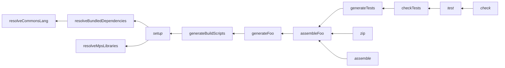

# MPS Gradle plugin

A Gradle plugin to package and publish MPS libraries. Use it if you have developed a library of plugins in MPS and you
want to make it easy for other developers to use your library in their projects.

This plugin does not cover publishing to the JetBrains Plugins Repository. [I recommend against publishing most plugin
libraries to the JetBrains Plugins Repository.](https://specificlanguages.com/posts/2022-01/24-two-kinds-of-plugins/)

## Compatibility

The plugin has been tested with Gradle 9.2.1.

## Overview

The plugin adds several extensions to the Gradle project. The build author uses these extensions to describe the MPS
project, mainly specifying which build scripts it contains and what are the dependencies between them. The plugin then
uses this information to create Gradle tasks to build the project.

## Prerequisites

The production build scripts of the project should not put the produced plugins into a zip file since the zip file will
be created by the plugin (`zip` task). It is enough to place the plugins directly in the top-level directory.

Example:

```
default layout:
module com.mbeddr.mpsutil.common 
module com.mbeddr.mpsutil.common.build
...
```

or

```
...
default layout:
plugin com.mbeddr.mpsutil.common [auto packaging]
  <empty>
```

## Applying the plugin

Apply the plugin in `build.gradle.kts`:

```kotlin
// build.gradle.kts
plugins {
    id("com.specificlanguages.mps") version "2.0.0"
}
```

You will also need to add the itemis Nexus (or its mirror) as both a plugin repository and a project repository:

```kotlin
// settings.gradle.kts
pluginManagement {
    repositories {
        maven("https://artifacts.itemis.cloud/repository/maven-mps")

        // Gradle plugin portal must be added explicitly when using non-default repositories
        gradlePluginPortal()
    }
}

// build.gradle.kts
repositories {
    maven("https://artifacts.itemis.cloud/repository/maven-mps")
    mavenCentral()
}
```

As a plugin repository, the itemis repository is necessary to download the dependencies of this plugin, including MPS
launcher, a library used to provide parameters necessary to launch each MPS version. (The launcher is part of
[mps-build-backends](https://github.com/mbeddr/mps-build-backends).)

As a project repository, the itemis repository provides MPS, the JBR, and a small "backend" program to launch MPS from
the command line (also part of mps-build-backends). The Maven Central repository contains the dependencies of the
backend.

## Specifying the versions of MPS and JBR to use

The plugin registers two configurations, `mps` and `jbr`, for specifying the versions of MPS and JBR to use. Each
configuration should contain exactly one dependency (to be resolved to one file). Example:

```kotlin
dependencies {
    mps("com.jetbrains:mps:2025.1.1")
    jbr("com.jetbrains.jdk:jbr_jcef:21.0.6-b895.109") // OS/architecture classifier will be added at run time by the plugin
}
```

The plugin will download the specified MPS distribution and the distribution of the JBR for the current platform.
The specified JBR and not the Gradle JVM will be used to run all MPS build tasks.

## Specifying external MPS dependencies

The `api` configuration (analogously to the
[`java-library` Gradle plugin](https://docs.gradle.org/current/userguide/java_library_plugin.html)) specifies
the dependencies of the project:

```kotlin
dependencies {
    api("de.itemis.mps:extensions:2025.1.+")
}
```

Add test-only dependencies to `testImplementation` configuration:

```kotlin
dependencies {
    testImplementation("org.mpsqa:all-in-one:2025.1.+")
}
```

Test-only dependencies will not be listed in the published POM file.

There is no `implementation` configuration because MPS does not support hiding implementation dependencies from
consumers at the moment. For example, the consumer's build script has to specify the location of every transitive
dependency of each library it consumes.

## Describing MPS build scripts

Example:

```kotlin
mpsBuilds {
    val languages by creating(MainBuild::class) {
        mpsProjectDirectory = layout.projectDirectory.dir("code") // defaults to layout.projectDirectory
        buildArtifactsDirectory =
            layout.buildDirectory.dir("artifacts/my.languages") // usually `build/artifacts/<MPS-build-script-name>`
        buildSolutionDescriptor = layout.projectDirectory.file("solutions/my.library.build/my.library.build.msd")
        buildFile = layout.buildDirectory.file("generated/build-main.xml")
    }

    val tests by creating(TestBuild::class) {
        dependsOn(languages)
        mpsProjectDirectory = layout.projectDirectory.dir("code") // defaults to layout.projectDirectory
        buildArtifactsDirectory =
            layout.buildDirectory.dir("artifacts/my.tests") // usually `build/artifacts/<MPS-build-script-name>`
        buildSolutionDescriptor = layout.projectDirectory.file("solutions/my.tests.build/my.tests.build.msd")
        buildFile = layout.buildDirectory.file("generated/build-tests.xml")
    }
}
```

For each MPS build script that you have in your project, you have to add an entry to the `mpsBuilds` container.
Main (production) build scripts are represented by an object of class `MainBuild`, test scripts are represented by
`TestBuild` objects.

For each build script (`BuildProject` MPS root), specify:

- `mpsProjectDirectory` – the MPS project directory (if different from the Gradle project directory).
- `buildArtifactsDirectory` – the directory where the build places (or should place) its artifacts. By default, this is
  `build/artifacts/<BuildProject.name>`, where `BuildProject.name` is the name of the build project root node. However,
  it has to be specified explicitly because the plugin does not read MPS build models. Ant property `build.layout` will
  be set to this directory when the corresponding Ant script is executed.
- `buildSolutionDescriptor` – the path to the descriptor of the build solution (the `.msd` file).
- `buildFile` – the path to the Ant script generated from the MPS build project.

`MainBuild` objects have an additional property:

- `published` – whether the artifacts produced by the build are to be published externally. Publishing is enabled by
  default for all main builds but can be disabled for sandbox builds, for example.

### Dependencies between build scripts

Use the `dependsOn()` method specify that a particular build script depends on another build script (such as `tests`
depending on `languages` in the example above). A script (test or main) may only depend on a main build script.

### Custom configuration of tasks

`MainBuild` and `TestBuild` objects give access to the tasks that will be generated for the builds (see [Tasks](#tasks)
below). Use `generateTask`, `assembleTask` (`MainBuild` only), and `assembleAndCheckTask` (`TestBuild` only) properties
to add custom configuration to the tasks, for example.

## Describing bundled dependencies

Add an entry to the `bundledDependencies` container to have Gradle download external libraries and place them in a
specific directory inside the source tree. This is most commonly used for external jars to be used in MPS via stub
solutions, but can also be used for bundling external executables or resources.

Example:

```kotlin
bundledDependencies {
    create("commonsLang") {
        destinationDir = layout.projectDirectory.dir("solutions/commons.lang/lib")

        configuration {
            isTransitive = false
        }

        dependency("org.apache.commons:commons-lang3:3.19.0")
    }
}
```

Each entry has the following properties:

- `destinationDir` – the directory where downloaded files should be placed. Each entry must specify a unique destination
  directory.
- `configuration` (read-only) – the Gradle dependency configuration for the entry. The configuration can be customized
  to be non-transitive or request a particular attribute, etc.
- `dependency` – the Gradle dependency collector for the configuration. Can be invoked as a function to add a dependency
  to the configuration.

For each bundled dependency a `resolve<Name>` task of type `Sync` is registered. The task will resolve the configuration
and put the resolved files into `destinationDir` while stripping version numbers.

Version numbers are stripped from the downloaded files to reduce the number of changes necessary for version updates.

## Tasks

Based on the above configuration, the plugin creates the following tasks:

- `generateBuildScripts` – runs the MPS generator to generate Ant files for all specified build scripts.
- `setup` – depends on tasks necessary to be able to open the project in MPS, such as downloading external MPS
  dependencies and bundled dependencies.
- `zip` – packages all artifacts of published main builds into a zip file.
- `test` – runs tests in all test build scripts. `test` is a lifecycle task that does nothing on its own but depends on
  `check<Name>` tasks of all test build scripts.

For each entry in `bundledDependencies` the following task is created:

- `resolve<Name>` – resolve the dependencies and put them in the destination directory, stripping version numbers
  (see [Describing bundled dependencies](#describing-bundled-dependencies)).

For each build script in `mpsBuilds` the following tasks are created:

- `generate<Name>` – runs the `generate` Ant target of a single build script. Depends on the `assemble` targets of its
  build script dependencies.
- `assemble<Name>` (main build scripts only) – runs the `assemble` target of the generated build script.
- `check<Name>` (test build scripts only) – runs the `check` target of the generated build script. In the build scripts
  generated by MPS the `check` target depends on `assemble`, thus `assemble` is always run together with `check`.

The plugin also applies the Gradle `base` plugin and adds dependencies to the base lifecycle tasks, `assemble` (assemble
all main build scripts) and `check` (depends on `test`).

The `check` and `test` tasks are currently equivalent but it is expected that `check` will be extended in the future to
perform additional checks such as model checks or migration checks, whereas `test` will continue to only run tests.

## Task dependency graph

Given a bundled dependency `commonsLang`, a `MainBuild` named `foo`, and a `TestBuild` named `tests` that depends on
`foo`, the registered tasks will look like this:



### `RunAnt` task type

The plugin exposes a task type to run Ant scripts, named `com.specificlanguages.mps.RunAnt`. This task can be used
to run arbitrary targets of arbitrary Ant scripts. When the plugin is applied, all `RunAnt` tasks are pre-configured
with conventions for running MPS build scripts.

As an example, you can create a Gradle task to invoke `myBuild.xml` and call target `myTarget`:

```kotlin
// build.gradle.kts
val myTask by tasks.registering(RunAnt::class) {
    buildFile = file("myBuild.xml")
    classpath.from(configurations.named("myAnt")) // default: 'ant' configuration

    pathProperties.put("mps_home", file("/my/mps/home"))
    valueProperties.put("version", provider { project.version.toString() })

    targets.set(listOf("myTarget")) // no default
}
```

Pre-configured conventions include:

- `javaLauncher` – set to `mpsDefaults.javaLauncher` (see [Customizing conventions](#customizing-conventions)),
- `classpath` – set to `mpsDefaults.antClasspath`,
- `valueProperties` – add `version` with the value of `project.version.toString()` (computed lazily by a provider)
- `pathProperties`:
    - add paths for `mps_home`, `mps.home`, `build.jna.library.path` properties, based on `mpsDefaults.mpsHome`,
    - add properties to place MPS caches and logs underneath the task's temporary directory,
    - add all properties from `mpsDefaults.pathVariables`

## Publishing

To publish the artifact produced by `zip` task, use `from(components["mps"])` in a publication.

Example:

```kotlin
publications {
    create<MavenPublication>("library") {
        from(components["mps"])
    }
}
```

## Customizing conventions

The plugin specifies default values for the tools used and some locations. If necessary, these defaults can be
customized through the `mpsDefaults` extension:

```kotlin
mpsDefaults {
    // Custom MPS home directory
    mpsHome = file("/my/mps/home")

    // Custom dependencies directory
    mpsLibrariesDirectory = file("build/project-libraries")

    // Path variables/Ant macros
    pathVariables.put("xyz", file("some/path"))

    // A custom Java launcher
    javaLauncher = toolchains.launcherFor { ... }

    // A custom Ant classpath
    antClasspath.from(myCustomAntConfig)
}
```

The following properties can be customized:

- `mpsHome` – uses the unzipped MPS from the `mps` configuration by default. Override to use MPS obtained by other
  means.
- `javaLauncher` – uses the JVM from the `jbr` configuration by default. Override to use a different Java runtime.
- `antClasspath` – uses the Ant distribution bundled with MPS by default. Override to use a different Ant version.
- `mpsLibrariesDirectory` – the directory where downloaded MPS libraries from the `api` configuration will be extracted.
- `pathVariables` – can be used to specify custom path variables. These are added to the MPS environment for the
  `generateBuildScripts` task and passed as Ant properties to all `RunAnt` tasks.

## MPS and JBR caching

This plugin uses the [mps-platform-cache](../mps-platform-cache/README.md) plugin to cache MPS and JBR distributions.
By default, MPS and JBR are extracted under the root project's build directory, but you can opt in to share these
distributions among all projects by setting `com.specificlanguages.mps-platform-cache.cacheRoot` property in your user
`gradle.properties` file. For more details, see [mps-platform-cache](../mps-platform-cache/README.md).

## Sample projects

Projects using the plugin:

* [MPS-extensions](https://github.com/JetBrains/MPS-extensions)
